## Hadoop运行环境搭建（开发重点）

## 1.1 模板虚拟机环境准备

安装虚拟机，可参考k8s中的介绍文章

> 虚拟机处理器配置：所有虚拟机处理器内核数<当前虚拟机cpu数量
> 

创建新的磁盘：磁盘大小推荐为50G

**1）、安装epel-release**

注：Extra Packages for EnterpriseLinux 是为 “红帽系”的操作系统提供额外的软件包，适用于RHEL、CentOS和Scientific Linux 。相当于是一个软件仓库，大多数rpm包在官方的 repository 中是找不到的

`yum install -y epel-release`

> 注意：如果 Linux 安装的是最小系统版，还需要安装如下工具；如果安装的是Linux 桌面标准版，不需要执行如下操作
> 
- [ ]  net-tool:工具包集合，包含ifconfig等命令`yum install -y net-tools`
- [ ]  vim：编辑器`yum install -y vim`

**2）、关闭防火樯，关闭防火墙开启自启**

`systemctl stop firewalld`

`systemctl disable firewalld.service`

> 注意：在企业开发中，通常单个服务器的防火墙是关闭的。公司整体会对外设置非常安全的防火墙
> 

**3）、创建用户，并修改用户密码:begin123**

`useradd begin`

`passwd begin`

**4）、配置begin用户具有root权限。方便后期sudo执行root权限的命令**

vim /etc/sudoers

修改/etc/sudoers 文件，在%wheel 这行下面添加一行，如下所示：

```java
## Allow root to run any commands amywhere
root    ALL=(ALL)     ALL
## Allow people in group wheel to run all commands
%wheel ALL=(ALL)    ALL
begin  ALL=(ALL)  NOPASSWD:ALL        <----此行
```

注意：begin这一行不要直接放到root 行下面，因为所有的用户都属于wheel组，你先配置了begin 具有免密功能，但是程序执行到 %wheel 行是，该功能又被覆盖回需要密码。所以这里要放到 %wheel 这行下面。

**5）、在/opt目录下创建文件夹，并修改所属主和所属组**

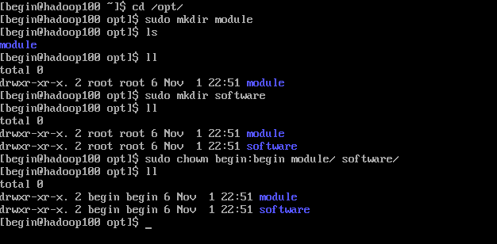

**6）、卸载虚拟机自带的JDK**

最小化安装忽略此步

### 克隆虚拟机


- 选择完整克隆
- 配置静态IP地址`cd /etc/sysconfig/network-scripts`

```java
TYPE="Ethernet"
PROXY_METHOD="none"
BROWSER_ONLY="no"
BOOTPROTO="static"
DEFROUTE="yes"
IPV4_FAILURE_FATAL="no"
IPV6INIT="yes"
IPV6_AUTOCONF="yes"
IPV6_DEFROUTE="yes"
IPV6_FAILURE_FATAL="no"
IPV6_ADDR_GEN_MODE="stable-privacy"
NAME="ens33"
UUID="2ffdc083-6d7c-441d-a5f6-313c80b9dd74"
DEVICE="ens33"
ONBOOT="yes"
IPADDR=192.168.158.130
NETMASK=255.255.255.0
GATEWAY=192.168.158.2
DNS=8.8.8.8
ZONE=public
NM_CONTROLLED=no
```

- 设置路由
1. **route -n --检查路由**
2. **vim /etc/resolv.conf --添加DNS**

```java
Generated by NetworkManager

search localdomain
nameserver 114.114.114.114
```

3、**添加永久静态路由**

`vi /etc/sysconfig/network-scripts/route-ens33`（没有该文件就新建一个）

```java
192.168.158.0/24 via 192.168.158.2
0.0.0.0/0 via 192.168.158.2
```

4、重启网卡，完成

**`service network restart` --重启网卡，使之生效**

### 安装JDK&Hadoop

### 安装JDK

1. 进入指定目录，没有新建一个 `cd /opt/software`


1. 解压到指定目录 `tar -zxvf jdk-…..jar -C /opt/module/`


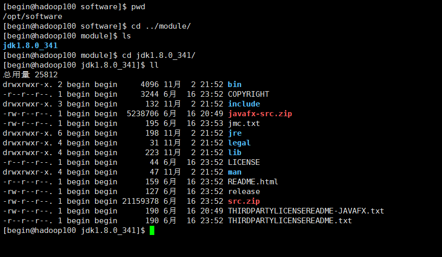

1. 配置java环境变量

创建文件 `sudo vim my_env.sh` 注意路径

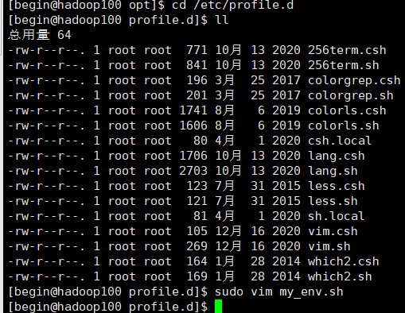

添加内容如下，JAVA_HOME为jdk安装包路径：


添加完成后刷新配置，完成 `source /etc/profile`

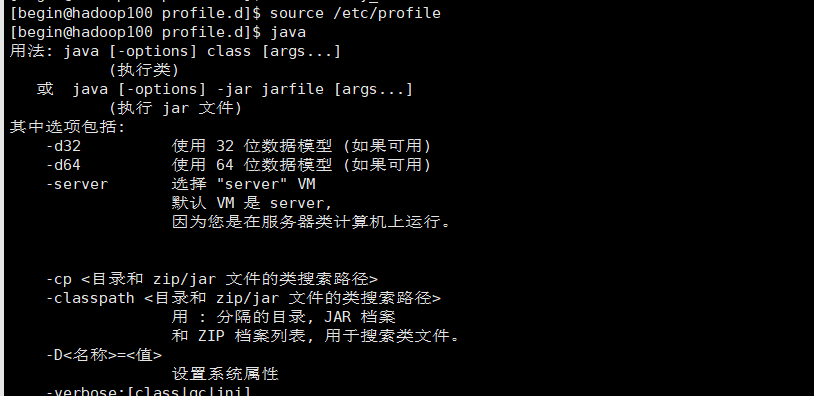

### 安装Hadoop

1. 同样解压到指定目录`tar -zxvf hadoop-3.1.3.tar.gz -C /opt/module`


1. 配置环境变量


1. 刷新配置，完成`source /etc/profile`

### 了解目录基本信息

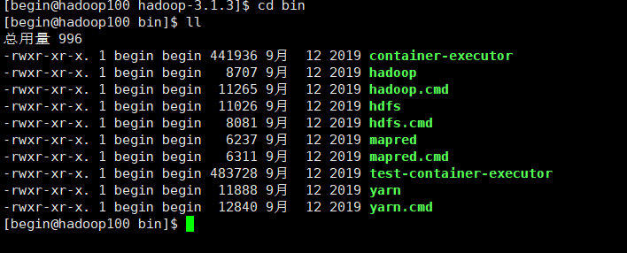

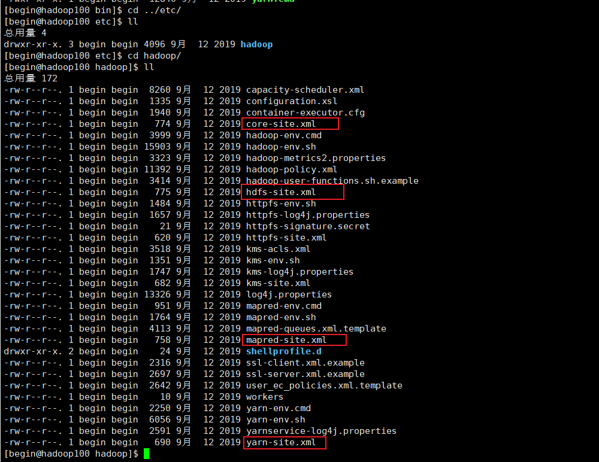

```html

bin和etc目录下常用到的：
hdfs:存储相关命令
mapred:计算相关命令
yarn:资源调度相关命令
```

## Hadoop运行模式

### 1、本地运行模式

参考官方文档：[Apache Hadoop 3.3.4 – Hadoop: Setting up a Single Node Cluster.](https://hadoop.apache.org/docs/stable/hadoop-project-dist/hadoop-common/SingleCluster.html#Standalone_Operation)

### 2、伪分布式运行模式，略

### 3、完全分布式运行模式

分析：

1. 准备3台客户机（关闭防火墙、静态IP、主机名称）
2. 安装JDK
3. 配置环境变量
4. 安装Hadoop
5. 配置环境变量
6. 配置集群
7. 单点启动
8. 配置ssh
9. 群起并测试集群

### **3.1  虚拟机准备，参考上文**

### **3.2  编写集群分发脚本xsync**

- **scp（secure copy）安全拷贝**
    1. scp 定义：scp 可以实现服务器与服务器之间的数据拷贝。（from server1 to server2）
    2. 基本语法
        
        ```html
        scp   -r    $pdir/$fname          $user@$host:$pdir/$fname 
        命令  递归  要拷贝的文件路径/名称  目的地用户@主机：目的地路径/名称
        ```
        
    3. 案例实操
        
        前提：在 hadoop102、hadoop103、hadoop104都已经创建好的/opt/module、/opt/software 两个目录，并且已经把这两个目录修改为 begin:begin
        
        ```html
        sudo chown begin:begin -R /opt/module
        ```
        
        1. 在 hadoop102 上，将hadoop102中/opt/module/jdk1.8.0_212 目录拷贝到hadoop103上
        
        ```html
        scp -r /opt/module/jdk1.8.0_212 begin@hadoop103:/opt/module
        ```
        
         b. 在 hadoop103 上，将hadoop102中/opt/module/hadoop-3.1.3目录拷贝到hadoop103上
        
        ```html
        scp -r begin@hadoop102:/opt/module/hadoop3.1.3 /opt/module/
        ```
        
- **rsync 远程同步工具**
    
    rsync 主要用于备份镜像。具有速度快、避免复制相同内容和支持符号链接的优点。rsync 和 scp 区别：用 rsync 做文件的复制要比 scp 的速度快，rsync 只对差异文件更新。scp 是把所有文件都复制过去。
    
    1. 基本语法
    
    ```html
    rsync  -av      $pdir/$fname           $user@$host:$pdir/fname
    命令   选项参数  要拷贝的文件路径/名称  目的地用户@主机：目的地路径/名称
    
    --------
    选项参数说明：
    -a  :归档拷贝
    -v  :显示复制过程
    ```
    
    1. 案例实操
    
    a. 删除 hadoop103 中/opt/module/hadoop-3.1.3/wcinput
    
    ```html
    rm -rf wcinput
    ```
    
    b. 同步 hadoop102 中的 /opt/module/hadoop-3.1.3 到 hadoop103
    
    ```html
    rsync  -av  hadoop-3.1.3/ begin@hadoop103:/opt/module/hadoop-3.1.3
    ```
    
- **xsync集群分发脚本**
1. 需求：循环复制文件到所有节点的相同目录下
2. 需求分析：
    1. rsync命令原始拷贝
    
    ```html
    rsync -av  /opt/module   begin@hadoop104:/opt/
    ```
    
     b. 期望脚本：
    
    xsync要同步的文件名称
    
    c. 期望脚本在任何路径都能使用（脚本放在声明了全局环境变量的路径）
    
    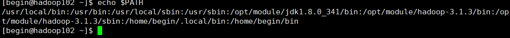
    

### **3.3 SSH无密登录配置**

1. 脚本实现
    1. 在 /home/begin/bin 目录下创建xsync文件
    
    
    
    在该文件中编写如下代码
    
    ```html
    
    #!/bin/bash
    
    #1.判断参数格式
    if [ $# -lt 1 ]
    then
    		echo Not Enough Arguement!
    		exit;
    fi
    #2.遍历集群所有机器
    for host in hadop102 hadoop103 hadoop104
    do
    	echo ------------------ $host ---------------------------
    	#3.遍历所有目录，挨个发送
    	
    	for file in $@
    	do
    		#4.判断文件是否存在
    		if [ -e $file ]
    				then
    						#5.获取父目录
    						pdir=$(cd -P $(dirname $file); pwd)
    						
    						#6.获取当前文件的名称
    						fname=$(basename $file)
    						ssh $host "mkdir -p $pdir"
    						rsync -av $pdir/$fname $host:$pdir
    				else
    						echo $file does not exists!
    		fi
    	done
    done				 
    ```
    
    b. 修改脚本 xsync 具有执行权限
    
    ```html
    chmod +x xsync
    ```
    
    c. 测试脚本
    
    ```html
    xsync /opt/software
    ```
    
    d. 将脚本复制到/bin中，以便全局调用
    
    ```html
    sudo cp xsync /bin/
    ```
    
    e. 同步环境变量配置(root 所有者),`注意目录`
    
    ```html
    [begin@hadoop102 ~] sudo ./bin/xsync /etc/profile.d/my_env.sh
    ```
    
    > 注意：如果使用了 sudo ，那么 xsync 一定要给它的路径补全
    > 
    
    让环境变量生效 `source /etc/profile`
    
    1. 配置 ssh
        - 基本语法
            
            ssh另一台电脑的IP地址
            
        - ssh 链接是出现Host Key verification failed 的解决方法
        
        ```html
         ssh hadoop103
        ```
        
        如果出现如下内容
        
        ```html
        Are you sure you want to continue connecting (yes/no)?
        ```
        
        输入 yes ,并回车
        
        - 退回到 hadoop102
        
        ```html
        [begin@hadoop103 ~]$ exit
        ```
        
    2. 无秘钥配置
        - 免密登录原理
        
        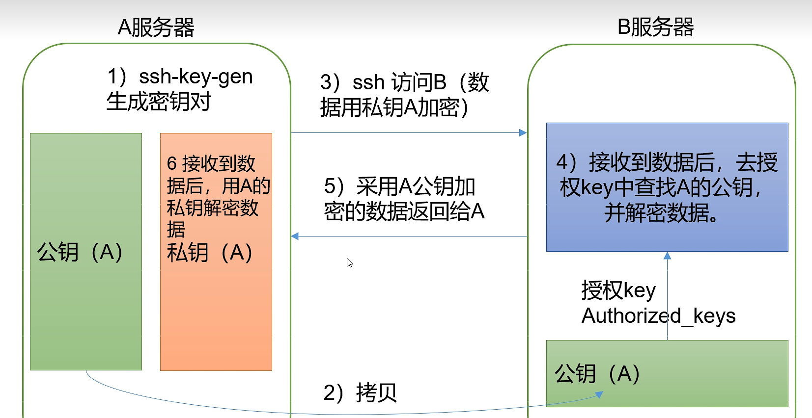
        
        1. 生成 rsa 公钥私钥，注意文件目录，三次回车直接确定就好
        
        
        
        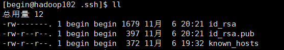
        
        1. 公钥拷贝至其他服务器，第一次需要密码
        
        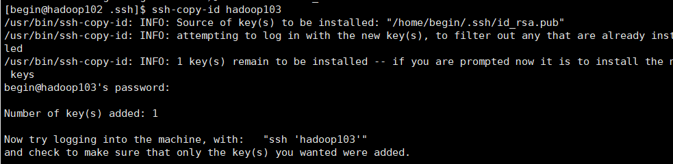
        
        1. 完成后可直接链接
        
        
        
        1. 免密登录文件
        
        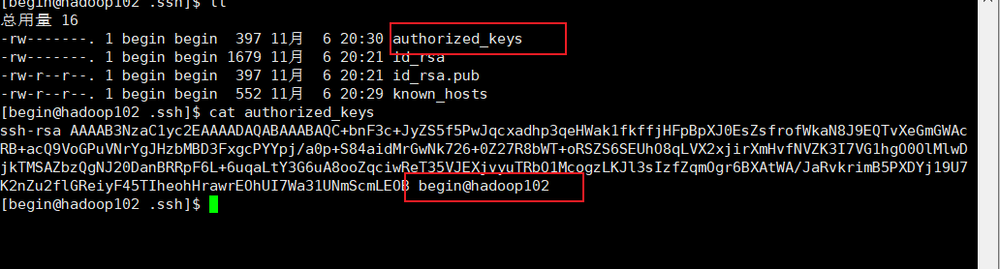
        

### 3.4 集群配置

1. **集群部署规划**
    
    注意：
    
    > NameNode 和 SecondaryNameNode 不要安装在同一台服务器
    > 
    
    > ResourceManager 也很消耗内存，不要和NameNode、SecondaryNameNode 配置在同一台机器上。
    > 
    
    |  | hadoop102 | hadoop103 | hadoop104 |
    | --- | --- | --- | --- |
    | HDFS | NameNode
    DataNode | 
    DataNode | SecondaryNameNode
    DataNode |
    | YARN | 
    NodeManager | ResourceManager
    NodeManager | 
    NodeManager |
2. **配置文件说明**
    
    Hadoop 配置文件分两类：默认配置文件和自定义配置文件，只有用户想修改某一默认配置值时，才需要修改自定义配置文件，更改相应属性值。
    
    （1）默认配置文件：
    
    | 要获取的默认文件 | 文件存放在 Hadoop 的 jar 包中的位置 |
    | --- | --- |
    | [core-default.xml] | hadoop-common-3.1.3.jar/core-default.xml |
    | [hdfs-default.xml] | hadoop-hdfs-3.1.3.jar/hdfs-default.xml |
    | [yarn-default.xml] | hadoop-yarn-common-3.1.3.jar/yarn-default.xml |
    | [mapred-default.xml] | hadoop-mapreduce-client-core-3.1.3.jar/mapred-default.xml |
    
    (2)、自定义配置文件：
    
    core-site.xml、hdfs-site.xml、yarn-site.xml、mapred-site.xml 四个配置文件存放在 $HADOOP_HOME/etc/hadoop 这个路径上，用户可以根据项目需求重新进行修改配置。
    
    > 注意：Hadoop2.x和Hadoop3.x的自定义配置文件有一些改变
    > 
    
    Hadoop2.x：core-site.xml、hdfs-site.xml、mapred-site.xml、yarn-site.xml、slaves
    Hadoop3.x：core-site.xml、hdfs-site.xml、mapred-site.xml、yarn-site.xml、workers
    [hadoop-env.sh](http://hadoop-env.sh/): 用于定义hadoop运行环境相关的配置信息，比如配置JAVA_HOME环境变量、为hadoop的JVM指定特定的选项、指定日志文件所在的目录路径以及master和slave文件的位置等；
    
    core-site.xml: 用于定义系统级别的参数，如HDFS URL、Hadoop的临时目录以及用于rack-aware集群中的配置文件的配置等，此中的参数定义会覆盖core-default.xml文件中的默认配置
    
    hdfs-site.xml: HDFS的相关设定，如文件副本的个数、块大小及是否使用强制权限等，此中的参数定义会覆盖hdfs-default.xml文件中的默认配置；
    
    mapred-site.xml：HDFS的相关设定，如reduce任务的默认个数、任务所能够使用内存的默认上下限等，此中的参数定义会覆盖mapred-default.xml文件中的默认配置；
    
3. **配置集群**
    
    > 先在单个节点上配置好，然后在向集群分发文件。
    > 
    - 进入配置文件目录
    
    ```html
    [begin@hadoop102 ~]$ cd $HADOOP_HOME/etc/hadoop
    ```
    
    - （1）核心配置文件
    
    ```html
    [begin@hadoop102 hadoop]$ vim core-site.xml
    
    # 在该文件中编写如下配置
    <!-- 指定HDFS中NameNode的地址  //内部通信地址，Web端无法通过8020访问 -->
    <property>
    		<name>fs.defaultFS</name>
          	<value>hdfs://hadoop102:8020</value>
          	<!-- <value>hdfs://hadoop100:9000</value> -->
    </property>
    
    <!-- 指定 Hadoop 数据存储的目录 -->
    <property>
    		<name>hadoop.tmp.dir</name>
    		<value>/opt/module/hadoop-3.1.3/data</value>
    </property>
    
    <!-- 配置 HDFS 网页登录使用的静态用户为 begin-->
    <property>
    		<name>hadoop.http.staticuser.user</name>
    		<value>begin</value>
    </property>
    
    <!-- 注：放在 <configuration> </configuration> 中间 -->
    ```
    
    - （2）HDFS配置文件
    
    配置`hadoop-env.sh`
    
    ```html
    [xqzhao@hadoop100 hadoop]$ vim hadoop-env.sh
    
    # 修改如下选项
    export JAVA_HOME=/opt/module/jdk1.8.0_144
    ```
    
    配置`hdfs-site.xml`
    
    ```html
    [begin@hadoop102 hadoop]$ vim hdfs-site.xml
    
    # 在该文件中编写如下配置
    <property>
    		<name>dfs.replication</name>
    		<value>3</value>
    </property>
    
    <!-- NameNode Web 端访问地址-->
    <property>
    		<name>dfs.namenode.http-address</name>
    		<value>hadoop102:9870</value>
    </property>
    
    <!-- SecondaryNameNode Web端访问地址 -->
    <property>
    		<name>dfs.namenode.secondary.http-address</name>
            <value>hadoop104:9868</value>
    </property>
    ```
    
    - (3) MapReduce配置文件
    
    配置`mapred-env.sh`
    
    ```html
    [xqzhao@hadoop100 hadoop]$ vim mapred-env.sh
    
    # 修改如下选项
    export JAVA_HOME=/opt/module/jdk1.8.0_144
    ```
    
    配置`mapred-site.xml`
    
    ```html
    [begin@hadoop102 hadoop]$ vim mapred-site.xml
    
    # 在该文件中增加如下配置
    <!-- 指定MR运行在Yarn上 -->
    <property>
    		<name>mapreduce.framework.name</name>
    		<value>yarn</value>
    </property>
    ```
    
    - (4) YARN配置文件
    
    配置`yarn-env.sh`
    
    ```html
    [xqzhao@hadoop100 hadoop]$ vim yarn-env.sh
    
    # 修改如下选项
    export JAVA_HOME=/opt/module/jdk1.8.0_144
    ```
    
    配置`yarn-site.xml`
    
    ```html
    [begin@hadoop102 hadoop]$ vim yarn-site.xml
    
    # 在该文件中增加如下配置
    <!-- 指定 MapReduce 走 shuffle -->
    <property>
    		<name>yarn.nodemanager.aux-services</name>
    		<value>mapreduce_shuffle</value>
    </property>
    
    <!-- 指定 YARN 的 ResourceManager 的地址 -->
    <property>
    		<name>yarn.resourcemanager.hostname</name>
    		<value>hadoop103</value>
    </property>
    
    <!-- 环境变量的继承 //可以认为是解决了一个小Bug -->
    <property>
    		<name>yarn.nodemanager.env-whitelist</name>			
    		<value>JAVA_HOME,HADOOP_COMMON_HOME,HADOOP_HDFS_HOME,HADOOP_CONF_DIR,CLASSPATH_PREPEND_DISTCACHE,HADOOP_YARN_HOME,HADOOP_MAPRED_HOME</value>
    </property>
    ```
    
4. **在集群上分发配置好的Hadoop配置文件**
    
    ```html
    [begin@hadoop102 etc]$ pwd
    /opt/module/hadoop-3.1.3/etc
    -----注意目录-----
    [begin@hadoop102 etc]$ xsync hadoop/
    ```
    
5. **查看文件分发情况**
    
    ```html
    [begin@hadoop102 hadoop]$ cat /opt/module/hadoop-3.1.3/etc/hadoop/core-site.xml
    ```
    

### 3.5 群起集群

1. ****配置workers****

```html
[begin@hadoop102 etc]$ cd /opt/module/hadoop-3.1.3/etc/hadoop
[begin@hadoop102 hadoop]$ vim workers
```

在该文件中增加如下内容：

```html
hadoop100
hadoop101
hadoop102
# 注意：该文件中添加的内容结尾不允许有空格，文件中不允许有空行。
```

同步分发所有节点配置文件：

```html
[begin@hadoop102 hadoop]$ xsync workers
```

1. 启动集群
- (1) 如果集群是`**第一次启动**`，需要**格式化** `NameNode`。(**`格式化`**)
    
    ```html
    #回到初始目录
    [begin@hadoop102 hadoop-3.1.3]$ pwd
    /opt/module/hadoop-3.1.3
    #初始化
    [begin@hadoop102 hadoop-3.1.3]$ hdfs namenode -format
    ```
    
    > **`注意`**：格式化 NameNode ,会产生新的集群 id，导致 NameNode 和 DataNode 的集群 id 不一致,集群找不到已往数据。如果集群在运行过程中报错，需要重新格式化 NameNode 的话，一定要先`停止`上次启动的所有 `namenode`和 `datanode`进程，然后再删除集群中每台虚拟机上的 `data`和`logs`目录。
    > 
    
    出现如下两个文件表示初始化成功：
    
    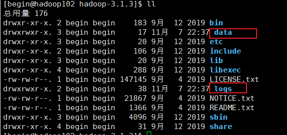
    
- (2) 启动`HDFS`
    
    ```html
    #启动
    [begin@hadoop102 hadoop-3.1.3]$ sbin/start-dfs.sh
    #查看102
    [begin@hadoop102 hadoop-3.1.3]$ jps
    2720 Jps
    2455 DataNode
    2331 NameNode
    ```
    
    ```html
    #查看103
    [begin@hadoop103 ~]$ jps
    1749 DataNode
    1802 Jps
    ```
    
    ```html
    #查看104
    [begin@hadoop104 ~]$ jps 
    2880 SecondaryNameNode
    2917 Jps
    2781 DataNode
    ```
    
    完成后可在浏览器打开如下界面`http://hadoop102:9870/`，打不开请检查防火墙和host文件
    
    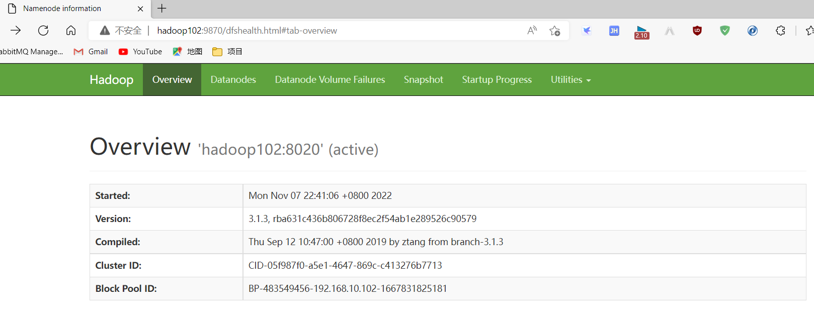
    
- (3) 在配置了`ResourceManger`的节点(`Hadoop103`)启动`YARN`
    
    ```html
    #注意要到配置了 ResourceManager 的节点执行命令，这里是103
    [begin@hadoop103 hadoop-3.1.3]$ sbin/start-yarn.sh
    ```
    
    ```html
    [begin@hadoop103 hadoop-3.1.3]$ sbin/start-yarn.sh 
    Starting resourcemanager
    resourcemanager is running as process 2009.  Stop it first.
    Starting nodemanagers
    hadoop102: nodemanager is running as process 2874.  Stop it first.
    hadoop103: nodemanager is running as process 2140.  Stop it first.
    [begin@hadoop103 hadoop-3.1.3]$ jps
    1749 DataNode
    2009 ResourceManager
    2827 Jps
    2140 NodeManager
    ```
    
    > 注意：`NameNode`和`ResourceManger`如果不是同一台机器，不能在`NameNode`上启动 YARN，应该在`ResouceManager`所在的机器上启动YARN。
    > 
- (4) Web端查看 HDFS 的 `NameNode`
    
    浏览器中输入：**http://hadoop102:9087** 如下图：
    
    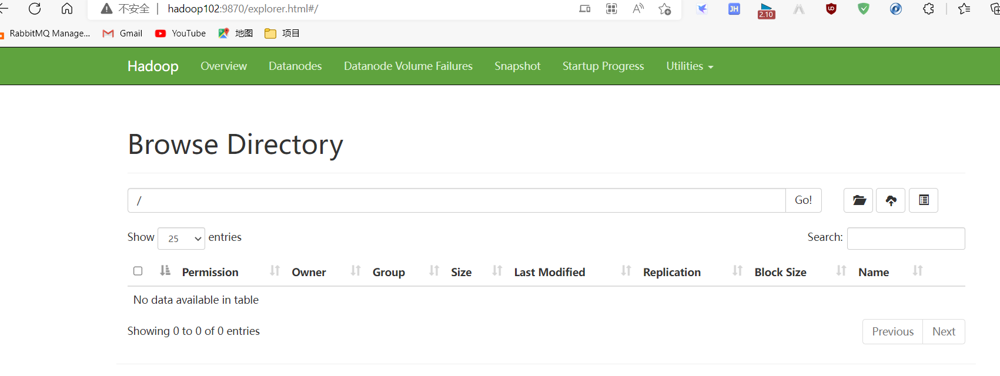
    
    Web端查看 YARN 的 `ResourceManager`
    
    浏览器中输入：**http://hadoop103:8088** 如下图:
    
    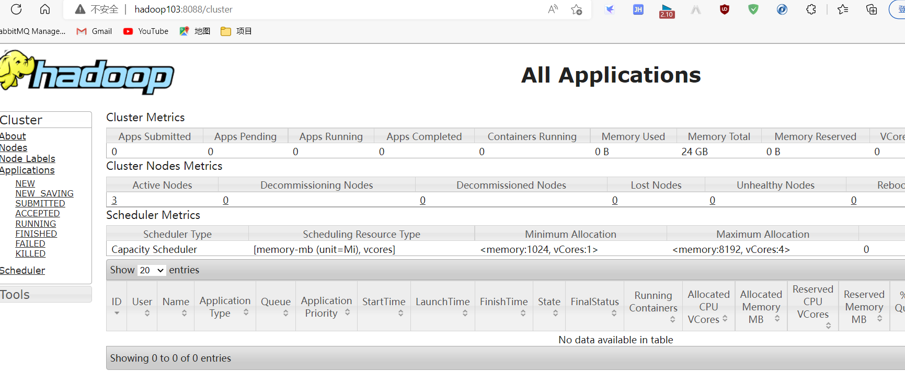
    
- (5) 在 `Hadoop102` 上启动 **`历史服务器`**
    
    为了查看程序的历史运行情况，需要配置一下历史服务器。具体配置步骤如下：
    
    1. 配置 mapred-site.xml
    
    ```html
    #进入到指定路径下
    [begin@hadoop102 hadoop]$ pwd
    /opt/module/hadoop-3.1.3/etc/hadoop
    [begin@hadoop102 hadoop]vim mapred-site.xml
    ```
    
    在该文件里面增加如下配置
    
    ```html
    <!-- 历史服务器地址 -->
    <property>
    		<name>mapreduce.jobhistory.adress</name>
    		<value>hadoop102:10020</value>
    </property>
    
    <!-- 历史服务器web端地址 -->
    <property>
    		<name>mapreduce.jobhistory.webapp.adress</name>
    		<value>hadoop102:19888</value>
    </property>
    ```
    
    1. 分发配置
    
    ```html
    [begin@hadoop102 hadoop] xsync mapred-site.xml
    ```
    
    1. 在 hadoop102 启动历史服务器；注意：启动前需要重启 yarn 读取上面配置
    
    ```html
    [begin@hadoop102 hadoop-3.1.3]bin/mapred --daemon start historyserver
    ```
    
    1. 查看历史服务器是否启动
    
    ```html
    [begin@hadoop102 hadoop-3.1.3]$ jps
    1364 NameNode
    2730 Jps
    1436 DataNode
    2444 NodeManager
    2668 JobHistoryServer
    ```
    
    1. 查看 JobHistory
    
    ```html
    [begin@hadoop102 hadoop-3.1.3]$ sbin/mr-jobhistory-daemon.sh start historyserver
    ```
    
    **`注:`** 启动历史服务器之前，需要先进行相应的配置,
    
    1. 配置日志的聚集
    - 日志聚集概念：应用运行完成以后，将程序运行日志信息上传到HDFS系统上。
    - 日志聚集功能好处：可以方便的查看到程序运行详情，方便开发调试。
    
    > 注意：开启日志聚集功能，需要重新启动NodeManager 、ResourceManager和HistoryManager。
    > 
    
    开启日志聚集功能具体步骤如下：
    
    - (1) 配置`yarn-site.xml`
    
    ```html
    [begin@hadoop102 hadoop]$ vim yarn-site.xml
    
    #在该文件里面增加如下配置。
    <!-- 开启日志聚集功能-->
    <property>
    	<name>yarn.log-aggregation-enable</name>
    	<value>true</value>
    </property>
    <!-- 设置日志聚集服务器地址-->
    <property>
    	<name>yarn.log-server-url</name>
    	<value>http:hadoop102:19888/jobhistory/logs</value>
    </property>
    
    <!-- 日志保留时间设置7天 -->
    <property>
    	<name>yarn.log-aggregation.retain-seconds</name>
    	<value>604800</value>
    </property>
    ```
    
    **分发配置：`xsynv $HADOOP_HOME/etc/hadoop/yarn-site.xml`**
    
    - (2) 关闭`NodeManager` 、`ResourceManager`和`HistoryServer`
    
    ```html
    [begin@hadoop102 hadoop-3.1.3]$ sbin/yarn-daemon.sh stop resourcemanager
    [begin@hadoop102 hadoop-3.1.3]$ sbin/yarn-daemon.sh stop nodemanager
    [begin@hadoop102 hadoop-3.1.3]$ mapred --daemon stop historyserver
    ```
    
    - (3) 启动`NodeManager` 、`ResourceManager`和`HistoryServer`
    
    ```html
    [begin@hadoop102 hadoop-3.1.3]$ sbin/yarn-daemon.sh start resourcemanager
    [begin@hadoop102 hadoop-3.1.3]$ sbin/yarn-daemon.sh start nodemanager
    [begin@hadoop102 hadoop-3.1.3]$ mapred --daemon start historyserver|
    ```
    
    - (4) 删除HDFS上已经存在的输出文件
    
    ```html
    [begin@hadoop102 hadoop-3.1.3]$ bin/hdfs dfs -rm -R /output
    ```
    
    - • (5) 执行WordCount程序
    
    ```html
    [begin@hadoop102 hadoop-3.1.3]$ [begin@hadoop102 hadoop-3.1.3]$ hadoop jar share/hadoop/mapreduce/hadoop-mapreduce-examples-3.1.3.jar  wordcount /wcinput /wcoutput
    ```
    
    - (6) 查看日志
    

### 3.6 群起集群并测试

- (1) 上传文件到集群

上传小文件

```html
[begin@hadoop102 hadoop-3.1.3]$ hadoop fs -mkdir /wcinput
[begin@hadoop102 hadoop-3.1.3]$ hadoop fs -put wcinput/word.txt/wcinput
```

上传大文件

- (2) 上传文件后查看文件存放在什么位置

查看HDFS文件存储路径

```html
/opt/module/hadoop-3.1.3/data/dfs/data/current/BP-483549456-192.168.10.102-1667831825181/current/finalized/subdir0/subdir0
```

查看HDFS在磁盘存储文件内容

```html
[begin@hadoop102 subdir0]$ cat blk_1073741825
hadoop yarn
hadoop mapreduce 
begin
begin
```

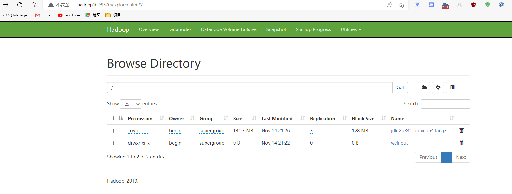

- (3) 拼接

```html
-rw-rw-r--. 1 begin begin 134217728 11月 14 21:26 blk_1073741825
-rw-rw-r--. 1 begin begin   1048583 11月 14 21:26 blk_1073741825_1001.meta
-rw-rw-r--. 1 begin begin  13944814 11月 14 21:26 blk_1073741826
-rw-rw-r--. 1 begin begin    108951 11月 14 21:26 blk_1073741826_1002.meta
[begin@hadoop102 subdir0]$ cat blk_1073741836>>tmp.file
[begin@hadoop102 subdir0]$ cat blk_1073741837>>tmp.file
[begin@hadoop102 subdir0]$ tar -zxvf tmp.file
```

- (4) 下载

```html
[begin@hadoop102 hadoop-3.1.3]$ bin/hadoop fs -get /user/begin/input/hadoop-3.2.1.tar.gz ./
```

- (5) 执行 wordcount 程序，查看 yarn 执行效果

```html
[begin@hadoop102 hadoop-3.1.3]$ hadoop jar share/hadoop/mapreduce/hadoop-mapreduce-examples-3.1.3.jar  wordcount /wcinput /wcoutput
```

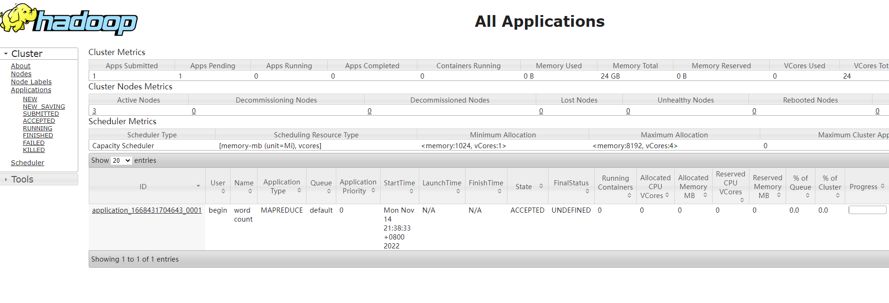

查看目录下执行结果

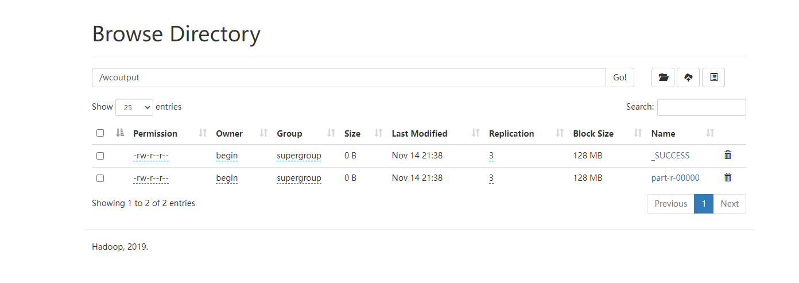

### 3.7 集群启动/停止方式总结

- （1）各个模块整体启动/停止 （配置 SSH 是前提）常用

```html
#整体启动/停止HDFS
[begin@hadoop102 hadoop-3.1.3]start-dfs.sh / stop-dfs.sh

#整体启动/停止YARN
[begin@hadoop102 hadoop-3.1.3]start-yarn.sh / stop-yarn.sh
```

- （2）分别启动/停止HDFS组件

```html
[begin@hadoop102 /]$ hadoop-daemon.sh  start / stop  namenode / datanode / secondarynamenode
```

### 3.8 两个常用脚本

- ****myhadoop.sh集群启动/停止脚本****

```html
#!/bin/bash

if [ $# -lt 1 ]
then
    echo "No Args Input..."
    exit ;
fi

case $1 in
"start")
        echo " =================== 启动 hadoop集群 ==================="

        echo " --------------- 启动 hdfs ---------------"
        ssh hadoop102 "/opt/module/hadoop-3.1.3/sbin/start-dfs.sh"
        echo " --------------- 启动 yarn ---------------"
        ssh hadoop103 "/opt/module/hadoop-3.1.3/sbin/start-yarn.sh"
        echo " --------------- 启动 historyserver ---------------"
        ssh hadoop102 "/opt/module/hadoop-3.1.3/bin/mapred --daemon start historyserver"
;;
"stop")
        echo " =================== 关闭 hadoop集群 ==================="

        echo " --------------- 关闭 historyserver ---------------"
        ssh hadoop102 "/opt/module/hadoop-3.1.3/bin/mapred --daemon stop historyserver"
        echo " --------------- 关闭 yarn ---------------"
        ssh hadoop103 "/opt/module/hadoop-3.1.3/sbin/stop-yarn.sh"
        echo " --------------- 关闭 hdfs ---------------"
        ssh hadoop102 "/opt/module/hadoop-3.1.3/sbin/stop-dfs.sh"
;;
*)
    echo "Input Args Error..."
;;
esac
```

使用：

[begin@hadoop102 hadoop-3.1.3]$ myhadoop.sh stop
xsync文件内容(此文件存放于操作用户的~/bin中，并附加x执行权限)

- ****jpsall脚本查看各节点组件****

```html
#!/bin/bash

for host in hadoop102 hadoop103 hadoop104
do
        echo =============== $host ===============
        ssh $host jps 
done
```

### 3.9 两道面试题 （重点）

[面试题及笔记](https://www.notion.so/d8e269292a324c4d8d0b3fcebe1781fb)

### 4.0 集群时间同步（集群无法同步外网时间时使用）

> 时间同步的方式：找一个机器，作为**时间服务器**
，所有的机器与这台集群时间进行定时的同步，比如，每隔十分钟，同步一次时间。
> 

时间服务器配置（必须root用户）步骤:

1. ****检查ntp是否安装****

```html
[root@hadoop102 bin]# rpm -qa|grep ntp

ntpdate-4.2.6p5-29.el7.centos.2.x86_64
ntp-4.2.6p5-29.el7.centos.2.x86_64

#未安装情况使用yum安装再执行操作
[root@hadoop102 bin]# sudo yum -y install ntp

#查看并设置所有节点ntpd服务状态和开机自启动状态
[root@hadoop102 bin]# sudo systemctl status ntpd
[root@hadoop102 bin]# sudo systemctl start ntpd
[root@hadoop102 bin]# sudo systemctl is-enabled ntpd
```

1. ****修改hadoop102的 /etc/ntp.conf 配置文件****

```html
[root@hadoop102 /]$sudo vim /etc/ntp.conf
```

修改内容如下:

- (1) 修改1（授权192.168.1.0-192.168.1.255网段上的所有机器可以从这台机器上查询和同步时间）

```html
#restrict 192.168.1.0 mask 255.255.255.0 nomodify notrap为
restrict 192.168.10.0 mask 255.255.255.0 nomodify notrap
(把前面的注释符’#'去掉了)
```

- (2) 修改2（集群在局域网中，不使用其他互联网上的时间）

```html
server 0.centos.pool.ntp.org iburst
server 1.centos.pool.ntp.org iburst
server 2.centos.pool.ntp.org iburst
server 3.centos.pool.ntp.org iburst 为
#server 0.centos.pool.ntp.org iburst
#server 1.centos.pool.ntp.org iburst
#server 2.centos.pool.ntp.org iburst
#server 3.centos.pool.ntp.org iburst
```

- (3) 添加3（当该节点丢失网络连接，依然可以采用本地时间作为时间服务器为集群中的其他节点提供时间同步）

```html
server 127.127.1.0
fudge 127.127.1.0 stratum 10
```

1. ****修改 /etc/sysconfig/ntpd 文件****

```html
[root@hadoop102 /]$sudo vim /etc/sysconfig/ntpd

增加内容如下（让硬件时间与系统时间一起同步）
SYNC_HWCLOCK=yes
```

1. ****重新启动ntpd服务****

```html
[root@hadoop102 /]$ service ntpd status
service ntpd status

[root@hadoop102 /]$ service ntpd start
Starting ntpd:                                       [  OK  ]
```

1. ****设置ntpd服务开机启动****

```html
[root@hadoop100 /]$ chkconfig ntpd on
```

1. ****其他机器配置（必须root用户）****

执行前先关闭所有节点上 ntp 服务和自启动

```html
[begin@hadoop103 ~]$ sudo systemctl stop ntpd
[begin@hadoop103 ~]$ sudo systemctl disable ntpd
[begin@hadoop104 ~]$ sudo systemctl stop ntpd
[begin@hadoop104 ~]$ sudo systemctl disable ntpd
```

- (1) 在其他机器配置10分钟与时间服务器同步一次

```html
[root@hadoop102 /]$ sudo crontab -e

编写定时任务如下：
*/10 * * * * /usr/sbin/ntpdate hadoop102
```

- (2) 修改任意机器时间

```html
[root@hadoop103 /]$ sudo date -s "2021-9-11 11:11:11"
```

- (3) 十分钟后查看机器是否与时间服务器同步

```html
[root@hadoop101 /]$ date
```

说明：测试的时候可以将10分钟调整为1分钟，节省时间。