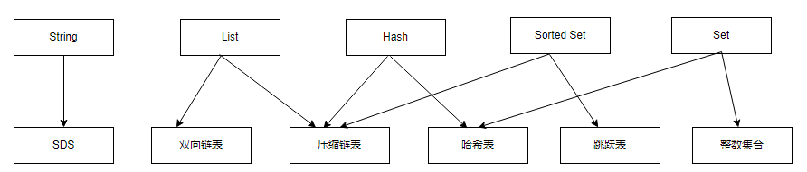
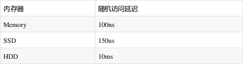
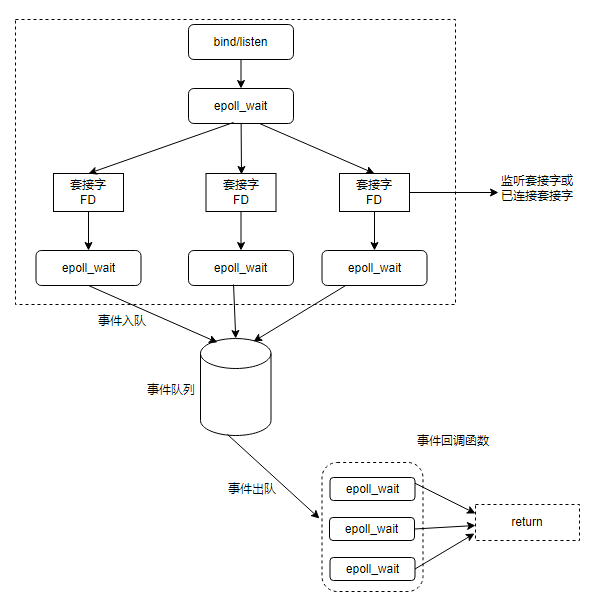

# Redis 基础

## Redis**简介**

> [Redis](https://redis.io/topics/introduction)是一个开源的，**基于内存的数据结构存储**，可用作于数据库、**缓存**、消息中间件。
> 

大家好，我是咖飞。接下来以笔记的方式熟悉下Redis常见基础知识点。

## 为什么要用 Redis

无论Redis也好、MySQL也好、HDFS也好、HBase也好，他们都是用来存储数据的地方。也因为它们的设计理念的不同，我们在使用时会根据不同的应用场景选择不同的存储。由官方的介绍很容易知道Redis一般是来用作缓存的，并且Redis存储的方式是以`key-value`的形式。

**我们可以发现这不就是Java的Map容器所拥有的特性吗，那为什么还需要Redis呢？**

- Java实现的Map是本地缓存，如果有多台实例(机器)的话，每个实例都需要各自保存一份缓存，缓存不具有一致性
- Redis实现的是分布式缓存，如果有多台实例(机器)的话，每个实例都共享一份缓存，缓存具有一致性。
- Java实现的Map不是专业做缓存的，JVM内存太大容易挂掉的。一般用做于容器来存储临时数据，缓存的数据随着JVM销毁而结束。Map所存储的数据结构，缓存过期机制等等是需要程序员自己手写的。
- Redis是专业做缓存的，可以用几十个G内存来做缓存。Redis一般用作于缓存，可以将缓存数据保存在硬盘中，Redis重启了后可以将其恢复。原生提供丰富的数据结构、缓存过期机制等等简单好用的功能。

**但是Redis的业务场景应该是什么呢，引入它解决了什么问题？**

前面说了，对于不同的业务场景，我们会使用不同的存储。当然啦，日常有的应用场景比较简单，用个HashMap也能解决很多的问题了，没必要上Redis。而对于并发量高的场景来说就并不适用了，通常在高并发的场景来说，首先扛不住的都是传统的关系型数据库如Mysql。比如秒杀的库存扣减，APP首页的访问流量高峰等等，都很容易把数据库打崩，所以引入了缓存中间件，目前市面上比较常用的缓存中间件有**Redis**和**Memcached**不过中和考虑了他们的优缺点，最后选择了Redis。

> PS：至于更细节的对比朋友们记得查阅Redis和Memcached的区别，比如两者的优缺点对比和各自的场景，后续我有时间也会写出来
> 

## Redis为什么这么快

咱们常常用到Redis。是因为它读写速度极快，一般用于缓存热点数据加快查询速度，大家在工作里面也肯定和 Redis打过交道，但是对于Redis为什么快，好像都还没特别深入的了解。接下来一起从几个方面探究下。

### ****高效的数据结构****

Redis 的底层数据结构一共有6种，分别是，简单动态字符串，双向链表，压缩列表，哈希表，跳表和整数数组，它们和数据类型的对应关系如下图所示：

1. 可以看出来，Redis 每一种数据类型底层都对应着多种实现和相应的优化。
2. Redis 存储方式是键值形式`key-value`，底层是哈希表，哈希表的时间复杂度是O(1)，有哈希表就一定有哈希冲突，redis对于哈希冲突的解决方案是链地址法（不清楚的话百度一下）。但是这样在数据多的时候访问性能也会下降，所以redis为了追求块，使用了两个全局哈希表。用于rehash（采用了渐进式rehash）操作，增加现有的哈希桶数量，减少哈希冲突。

> PS：数据结构优化内容和具体 rehash 方式后面会有文章单独介绍
> 

### 单线程

众所周知多线程能提高程序的吞吐量以及降低延迟，如果程序需要提升效率肯定会考虑引进多线程，但线程的数量并不是越多越好，线程数量增加CPU的上下文切换会带来资源的浪费，另外线程间会存在数据竞争为了保证数据的正确性需要添加互斥锁，互斥锁将有线程安全问题的数据串行执行保证线程安全，这也让程序的效率大打折扣。

redis为避免以上问题，索性只用单线程执行，redis官方解释如下

> 因为Redis是基于内存的操作，CPU不是Redis的瓶颈，Redis的瓶颈最有可能是机器内存的大小或者网络带宽。既然单线程容易实现，而且CPU不会成为瓶颈，那就顺理成章地采用单线程的方案了
> 

> PS：为了最大化CPU利用率，你可以在同一个节点中启动多个Redis实例视为不同的Redis服务
> 

### 基于内存

我们都知道redis是使用内存来进行数据的存储，这也是为什么redis的访问速度要远远快于mysql的主要原因，因为是使用内存存储数据，可以避免频繁的进行写盘操作，大大降低响应时间：

### ****I/O多路复用程序****

可以与java的nio进行类比，相当于就是使用的是非阻塞性io模型，一个线程可以处理多个客户端连接，并且通过事件监听的机制，并通过基于事件的回调机制，即针对不同事件的发生，Redis 将所有产生事件的套接字都放到一个队列里面，以有序、同步、每次一个套接字的方式向文件事件分派器传送套接字，文件事件分派器根据套接字对应的事件选择响应的处理器进行处理，通过这种事件回调机制，可以避免redis去一直轮询关注是否有对应的事件发生，避免cpu的浪费。相当于redis单线程不会阻塞在某一个特定的操作上，所以一个redis的服务端，可以提供给多个客户端进行连接

## 常见使用场景

| 数据类型 | 可以存储的值 | 操作 | 应用场景 |
| --- | --- | --- | --- |
| String | 字符串、整数或者浮点数 | 对整个字符串或者字符串的其中一部分执行操作
对整数和浮点数执行自增或者自减操作 | 做简单的键值对缓存
例子：
1. 热点数据缓存，对象缓存、全页缓存、可以提升热点数据的访问数据。
2. 分布式Session
3. 分布式锁（setnx）
4. 限流
5. 计数器 |
| List | 列表 | 从两端压入或者弹出元素
对单个或者多个元素进行修剪，只保留一个范围内的元素 | 存储一列列表的数据结构
例子：
1. 消息队列（blpop/brpop阻塞弹出）
2. 抽奖（spop myset）
3. 点赞（sadd/srem）、签到、打卡
4. 商品筛选
5. 商品标签 |
| Set | 无序集合 | 添加、获取、移除单个元素
检查一个元素是否存在于集合中
计算交集、并集、差集
从集合里面随机获取元素 | 交集、并集、差集的操作，比如交集，可以把两个人的粉丝列表整成一个交集 |
| Hash | 包含键值对的无序散列表 | 添加、获取、移除单个键值对
获取所有键值对
检查某个键是否存在 | 结构化的数据，比如一个对象
例子：购物车 |
| ZSet | 有序集合 | 添加、获取、删除元素
根据分值范围或者成员来获取元素
计算一个键的排名 | 去重但可以排序，比如获取排名前几名的用户
例子：百度热点排行 |

## **总结**

本文主要对 Redis 的使用场景和使用方式有了一个简单的理解，介绍了对于使用Redis的实际考虑和业务场景。高并发的情况下，Redis与传统关系型数据库的区别。至于更细节一点的数据结构讲解
后边会逐步更新。如果对于文章中的内容有疑问，可以留言指正，大家互相交流。谢谢支持！