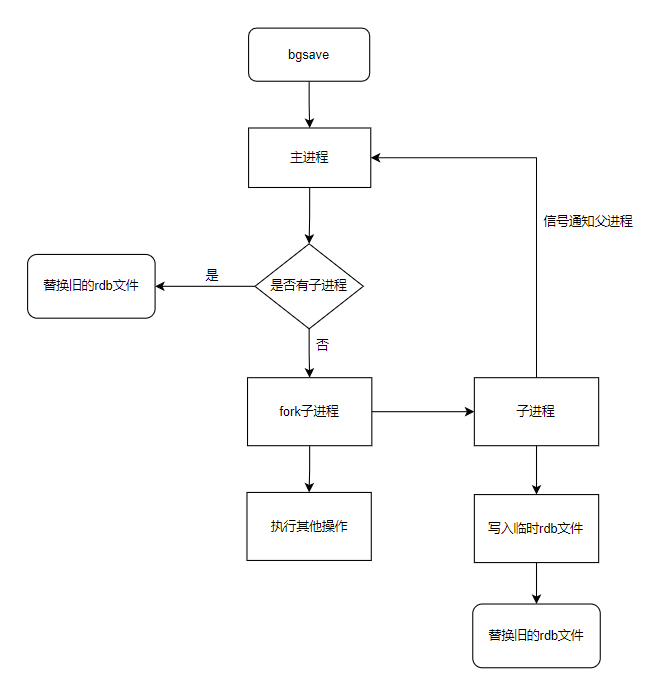
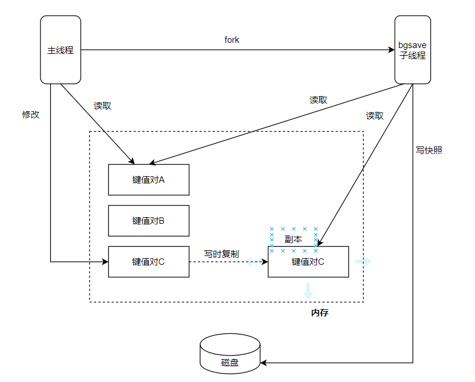
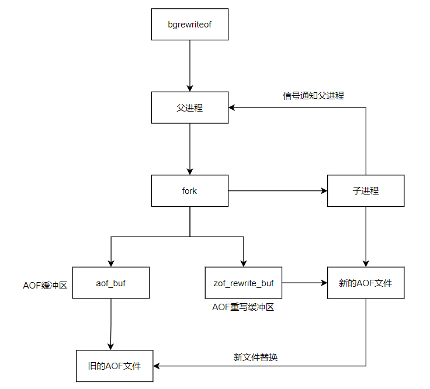
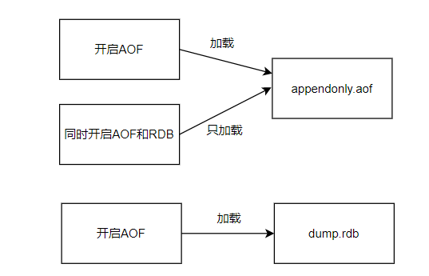
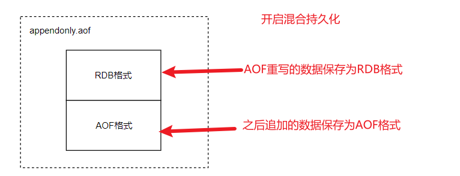
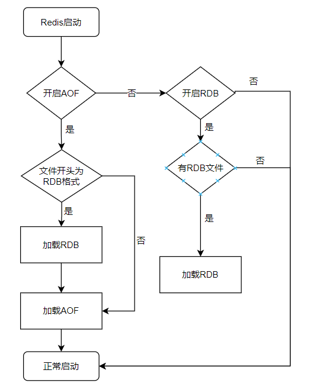

# Redis持久化

## 简介

由上一篇[Redis基础](./redis-basic.md)中我们已经知道了，Redis 的数据操作都是基于内存的。假设我们没有其他备份的方法，一旦 Redis 服务器重启或者宕机，那内存中的数据就会全部丢失。所以需要有一套机制保证数据不会因各种突发情况丢失，自然，Redis 给我们提供了相应的持久化机制，分别是RDB和AOF。保证内存中的数据能保存到磁盘。

## 什么是RDB持久化？

> RDB 持久化以指定的时间间隔执行数据集的时间点快照。
> 

### RDB配置项

**Redis 快照**是默认的 Redis 持久性模式。表示当满足特定条件时，它将生成数据集的时间点快照。在 `redis.conf`配置文件中默认有此下配置

```java
save 900 1           #在900秒(15分钟)之后，如果至少有1个key发生变化，Redis就会自动触发BGSAVE命令创建快照。

save 300 10          #在300秒(5分钟)之后，如果至少有10个key发生变化，Redis就会自动触发BGSAVE命令创建快照。

save 60 10000        #在60秒(1分钟)之后，如果至少有10000个key发生变化，Redis就会自动触发BGSAVE命令创建快照。
```

当然，通常情况下还会配置下列相关参数来配合使用

```java
stop-writes-onbgsave-error yes  
 
```

当 `stop-writes-on-bgsave-error` 设置为 yes 时，表示当备份进程出错时，主进程就会停止接收写入操作，从而保证了持久化数据的一致性

```java
rdbcompression yes
```

当 `rdbcompression` 设置为 `yes` 时，表示在备份的时候，需要将 RDB 文件进行压缩后再进行保存这里建议将其设置为 `no`，因为 Redis 本身属于 CPU 密集型服务器，再开启压缩，会带来更多的 CPU 消耗，相比硬盘成本，CPU 性价比更高.

```java
dbfilename dump.rdb
```

生成的 rdb 文件名称为 dump.rdb(配置文件的快照中进行配置)

### RDB****的触发机制****

触发RDB持久化的方式有2种，分别是**手动触发**和**自动触发**。

### 手动触发

手动触发分别对应`save`和`bgsave`命令

- `save`命令：阻塞当前Redis服务器，直到RDB过程完成为止，redis服务器在快照创建完毕之前将不在响应任何其他的命令，对于内存比较大的实例会造成长时间阻塞，线上环境不建议使用.
- `bgsave`命令：客户端可以使用`BGSAVE`命令来创建一个快照，当接收到客户端的`BGSAVE`命令时，redis 会调用 fork 函数来创建一个子进程，会先将数据写入到一个临时文件中，待持久化过程都结束了，再用这个临时文件替换上次持久化好的文件，而父进程则继续处理命令请求，Redis进程执行 fork 操作创建子进程，RDB持久化过程由子进程负责，完成后自动结束。阻塞只发生在fork 阶段，一般时间很短.

由于通常使用的的是`bgsave`,介绍下`bgsave`的具体流程：

1. Redis 客户端执行 bgsave 命令或者自动触发 bgsave 命令；
2. 主进程判断当前是否已经存在正在执行的子进程，如果存在，那么主进程直接返回；
3. 如果不存在正在执行的子进程，那么就 fork 一个新的子进程进行持久化数据，fork过程是阻塞的，fork 操作完成后主进程即可执行其他操作；
4. 子进程先将数据写入到临时的 rdb 文件中，待快照数据写入完成后再原子替换旧的rdb文件；
5. 同时发送信号给主进程，通知主进程rdb持久化完成，主进程更新相关的统计信息（info Persitence 下的 rdb_*相关选项）。



### 自动触发

在以下3种情况时会自动触发

1. redis.conf 中配置 `save m n`，即在m秒内有n次修改时，自动触发 bgsave 生成 rdb 文件；
2. 主从复制时，从节点要从主节点进行全量复制时也会触发 bgsave 操作，生成当时的快照发送到从节点； 执行 debug
3. reload 命令重新加载 redis 时也会触发 bgsave 操作； 默认情况下执行 shutdown 命令时，如果没有开启 aof 持久化，那么也会触发bgsave操作；

### ****做内存快照时，还能修改数据吗（COW机制）？****

由上面的介绍，可能会想到还有一个重要的问题是，我们在 **持久化的同时**，**内存数据结构**还可能在 **变化**，比如一个大型的 hash 字典正在持久化，结果一个请求过来把它删除了，可是这才刚持久化结束，咋办？

操作系统多进程 **COW(Copy On Write) 机制**拯救了我们。上述多次提到的 fork 函数指的是**Redis**在持久化时会调用 `glibc`的函数 `fork`产生一个子进程，简单理解也就是基于当前进程 **复制**了一个进程，主进程和子进程会共享内存里面的代码块和数据段。然后操作系统的 COW 机制会进行数据段页面的分离。数据段是由很多操作系统的页面组合而成，当父进程对其中一个页面的数据进行修改时，会将被共享的页面复 制一份分离出来，然后 对这个复制的页面进行修改。这时 子进程相应的页面是 没有变化的，还是进程产生时那一瞬间的数据。



### 如何恢复RDB文件

将 rdb 文件放到 redis 启动目录下就可以，redis 在启动时会自动检查 dump.rdb 文件并恢复其中的数据。

查看dump.rdb的文件位置

```java
127.0.0.1:6379> config get dir   #获取rdb文件位置
1) "dir"
2) "/usr/local/bin/yconfig"
127.0.0.1:6379>
```

## 什么是AOF持久化？

**AOF(Append Only File - 仅追加文件)**它的工作方式非常简单：每次执行 修改内存中数据集的写操作时，都会 记录该操作。假设 AOF 日志记录了自 Redis 实例创建以来 所有的修改性指令序列，那么就可以通过对一个空的 Redis 实例 顺序执行所有的指令，也就是 「重放」，来恢复 Redis 当前实例的内存数据结构的状态。

> 使用 RDB 持久化有一个风险，它可能会造成最新数据丢失的风险。因为 RDB 的持久化有一定的时间间隔，在这个时间段内如果 Redis 服务意外终止的话，就会造成最新的数据全部丢失。
> 

### AOF配置项

### 开启 AOF 持久化

Redis 默认是关闭 AOF 持久化的，想要开启 AOF 持久化，有以下两种方式：

- 通过命令行的方式，使用`config set appendonly yes`；

```java
127.0.0.1:6379> config get appendonly     #查看AOF开启情况
1) "appendonly"
2) "no"                              # no表示AOF未启动
```

```java
127.0.0.1:6379> config get appendonly yes    #命令行开启AOF
OK
127.0.0.1:6379> config get appendonly     #查看AOF开启情况
1) "appendonly"
2) "yes"                              # yes表示AOF已启动

127.0.0.1:6379> config rewrite        #保存修改的配置   
```

**命令行启动 AOF 的优缺点**：命令行启动优点是无需重启 Redis 服务，缺点是如果 Redis 服务重启，则之前使用命令行设置的配置就会失效。

- 通过修改配置文件的方式（redis.conf）可配置文件名称，默认为 appendonly.aof（aof文件的保存路径，同rdb的路径一致）。

```java
appendonly yes

appendfilename "appendonly.aof"
```

**配置文件启动 AOF 的优缺点**：修改配置文件的缺点是每次修改配置文件都要重启 Redis 服务才能生效，优点是无论重启多少次 Redis 服务，配置文件中设置的配置信息都不会失效。

### AOF同步频率设置

```java
appendfsync always     #始终同步，每次Redis的写入都会立刻记入日志；性能较差但数据完整性比较好
appendfsync everysec   #每秒同步，每秒记入日志一次，如果宕机，本秒的数据可能丢失。（生产常用）
appendfsync no         #redis不主动进行同步，把同步时机交给操作系统。
```

使用不同的fsync策略,Redis的性能保持的非常好(fsync是由后台线程进行处理的,主线程处理客户端请求)。`一旦出现故障，默认采用appendfsync everysec策略，最多丢失1秒的数据`

### AOF的触发机制

触发AOF持久化的方式同RDB也有2种，分别是**手动触发**和**自动触发**。

### 手动触发

手动触发对应`bgrewriteaof` 命令

### 自动触发

自动触发对应上诉配置中的同步频率，满足 AOF 设置的策略将会触发。

### 会出现的问题考虑（AOF重写）？

如果对所有命令存下来，不做任何处理。那么**Redis**在长期运行的过程中，AOF 的日志会越变越长。如果实例宕机重启，重放整个 AOF 日志会非常耗时，导致长时间 Redis 无法对外提供服务。所以需要对 **AOF 日志** 进行压缩操作，Redis当然也考虑到了这一点，提供了 `bgrewriteaof`指令，它会fork个子进程会对「原始」命令集合进行重写压缩并替换掉原始文件。

> PS：AOF刷盘是后台线程异步的，文件重写是fork子进程
> 

**AOF的文件重写流程如下：**



1. 父进程执行 fork 创建子进程，开销等同于 bgsave 过程。
2. 主进程 fork 操作完成后，继续响应其他命令。所有修改命令依然写入`AOF缓冲区` 并根据appendfsync 策略同步到硬盘，保证原有 AOF 机制正确性。
3. 由于fork操作运用写时复制技术，子进程只能共享 fork 操作时的内存数据。由于父进程依然响应命令，Redis使用`AOF重写缓冲区`保存这部分新数据，防止新 AOF文件生成期间丢失这部分数据。
4. 子进程根据内存快照，按照命令合并规则写入到新的AOF文件。每次批量写入硬盘数据量由配置`aof-rewrite-incremental-fsync`控制，默认为32MB，防止单次刷盘数据过多造成硬盘阻塞
5. 新AOF文件写入完成后，子进程发送信号给父进程，父进程更新统计信息。
6. 父进程把AOF重写缓冲区的数据写入到新的AOF文件。
7. 使用新AOF文件替换老文件，完成AOF重写。

### 如何恢复AOF文件

加载损坏的 AOF 文件时会拒绝启动，并打印如下日志：

```java
# Bad file format reading the append only file: make a backup of your AOF file, 
 
then use ./redis-check-aof --fix <filename>
```

对于错误格式的 AOF 文件，先进行备份，然后采用`redis-check-aof--fix`命令进行修复，修复后使用`diff -u`对比数据的差异，找出丢失的数据，有些可以人工修改补全。

AOF 文件可能存在结尾不完整的情况，比如机器突然掉电 导致 AOF 尾部文件命令写入不全，Redis为我们提供了`aof-load-truncated`配置来兼容这种情况，默认开启（Redis 在启动时会忽略最后一条命令，并顺利启动 Redis）。加载 AOF 时，当遇到此问题时会忽略并继续启动，同时打印如下警告日志：

```java
# !!! Warning: short read while loading the AOF file !!!
# !!! Truncating the AOF at offset 397856725 !!!
# AOF loaded anyway because aof-load-truncated is enabled
```

正常数据恢复，正常情况下，只要开启了 AOF 持久化，并且提供了正常的 appendonly.aof 文件，在 Redis 启动时就会自定加载 AOF 文件并启动，小贴士：默认情况下 appendonly.aof 文件保存在 Redis 的根目录下。

### AOF持久化文件加载规则

- 如果只开启了 AOF 持久化，Redis 启动时只会加载 AOF 文件（appendonly.aof），进行数据恢复；
- 如果只开启了 RDB 持久化，Redis 启动时只会加载 RDB 文件（dump.rdb），进行数据恢复；
- 如果同时开启了 RDB 和 AOF 持久化，Redis 启动时只会加载 AOF 文件（appendonly.aof），进行数据恢复。



### Redis持久化的面试问题

**重写后的AOF文件为什么可以变小？**

- 进程内已经超时的数据不再写入文件
- 旧的AOF文件含有无效命令，如del key1、hdel key2、srem keys、set a111、set a222等。重写使用进程内数据直接生成，这样新的AOF文件只保留最终数据的写入命令
- 多条写命令可以合并为一个，如：lpush list a、lpush list b、lpush list c可以转化为：lpush list a b c。为了防止单条命令过大造成客户端缓冲区溢出，对于list、set、hash、zset等类型操作，以64个元素为界拆分为多条。

## 混合持久化

RDB 和 AOF 持久化各有利弊，RDB 可能会导致一定时间内的数据丢失，而 AOF 由于文件较大则会影响 Redis 的启动速度，为了能同时使用 RDB 和 AOF 各种的优点，Redis 4.0 之后新增了混合持久化的方式。

**在开启混合持久化的情况下，AOF 重写时会把 Redis 的持久化数据，以 RDB 的格式写入到 AOF 文件的开头，之后的数据再以 AOF 的格式化追加到文件的末尾。**

> 内存快照以一 定的频率执行，在两次快照之间，使用 AOF 日志记录这期间的所有命令操作 ，在第二次快照后，清空AOF日志
> 



### 开启混合持久化

查询是否开启混合持久化可以使用 `config get aof-use-rdb-preamble`命令，执行结果如下：

```java
127.0.0.1:6379> config get aof-use-rdb-preamble  #查看混合持久化开启情况
1) "aof-use-rdb-preamble"
2) "yes"                                        # yes表示混合持久化开启
```

其中 yes 表示已经开启混合持久化，no 表示关闭，Redis 5.0 默认值为 yes。 如果是其他版本的 Redis 首先需要检查一下，是否已经开启了混合持久化，如果关闭的情况下，可以通过以下两种方式开启：

- **通过命令行开启**

使用命令 `config set aof-use-rdb-preamble yes`执行结果如下：

> PS：命令行设置配置的缺点是重启 Redis 服务之后，设置的配置就会失效。
> 

```java
127.0.0.1:6379> config get aof-use-rdb-preamble yes   
OK
127.0.0.1:6379> config get aof-use-rdb-preamble    
1) "aof-use-rdb-preamble"
2) "yes"                              
```

- **通过修改 Redis 配置文件开启**

在 Redis 的根路径下找到 redis.conf 文件，把配置文件中的 `aof-use-rdb-preamble no`改为 `aof-use-rdb-preamble yes`

```java
aof-use-rdb-preamble yes
```

### 数据恢复

混合持久化的数据恢复和 AOF 持久化过程是一样的，只需要把 appendonly.aof 放到 Redis 的根目录，在 Redis 启动时，只要开启了 AOF 持久化，Redis 就会自动加载并恢复数据。

### 混合持久化的加载流程

混合持久化的加载流程如下：



1. 判断是否开启 AOF 持久化，开启继续执行后续流程，未开启执行加载 RDB 文件的流程；
2. 判断 appendonly.aof 文件是否存在，文件存在则执行后续流程；
3. 判断 AOF 文件开头是 RDB 的格式, 先加载 RDB 内容再加载剩余的 AOF 内容；
4. 判断 AOF 文件开头不是 RDB 的格式，直接以 AOF 格式加载整个文件。

## 总结

- **Redis持久化机制**：RDB和AOF
- **RDB持久化**：定时任务，BGSAVE命令 fork一个子进程生成RDB文件（二进制）
- **AOF持久化**：根据配置将写命令存储至日志文件中，顺序写&&异步刷盘(子线程)，重写AOF文件也是需要 fork 子进程。
- **混合持久化**：Redis4.0之后支持，在开启混合持久化的情况下，AOF 重写时会把 Redis 的持久化数据，以 RDB 的格式写入到 AOF 文件的开头，之后的数据再以 AOF 的格式化追加到文件的末尾。