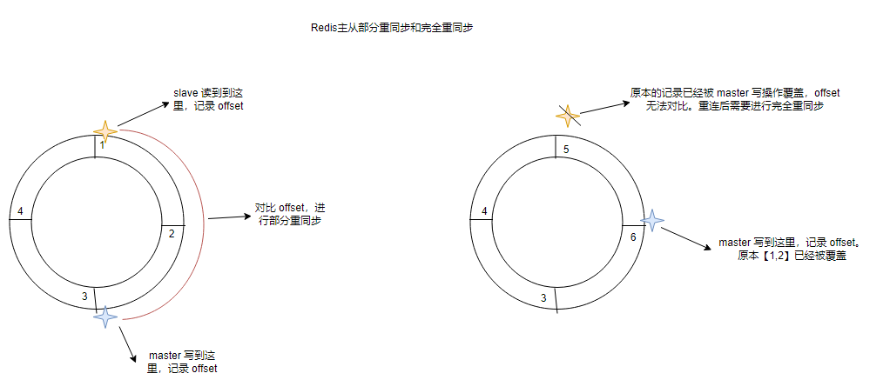
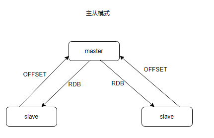
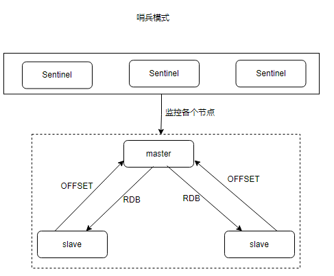
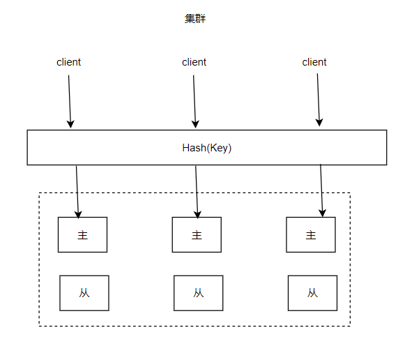

# Redis高可用

# 前言

Redis 作为一种高性能的内存数据库，普遍用于目前主流的分布式架构系统中。为了提高系统的容错率，使用多实例的 Redis 也是必不可免的，当然，随之而来的就是高可用问题，市面上也出现了一些高可用方案。今天，咖飞就带大家来学习下常见的几种方案是如何来保证高可用的。

# 高可用机制

Redis 的高可用从总体上来讲是通过 **冗余 + 故障转移** 来实现的，而对于冗余和故障转移又可以细化为：全部冗余或部分冗余；手动转移或自动转移。

全部冗余+手动转移的方案就是我们最熟悉的**主从模式**了；当手动转移变为自动转移时即**哨兵模式**。最后部分冗余 + 自动转移则是**集群模式**。

由于 Redis 不像 mysql，在数据的完整性、一致性上是没有比较好的保障的，所以当我们在使用高可用方案时，对数据的一致性就期望不了那么高了，这是需要提前注意的（所以数据是**最终一致性**）。

# 主从模式

## 概述

主从模式在高可用方案中是最常用的一种。在分布式系统中为了解决单点问题，通常我们会在不同的机器上部署着同一 Redis 程序。在这多台机器里，我们会选择一个节点作为主节点（master），它负责数据的写入。其他节点作为从节点（slave），定时的和主节点同步数据。一旦主节点不能使用了，那么就可以在从节点中挑选一个作为主节点，继续提供服务。

主从模式往往还能进行读写分离，将读取数据的压力分散到多个 slave 上，slave 一般只提供读操作，并接收主数据库同步过来的数据。

所以咱们可以知道**引入主从复制的目的有两个：**

1. 容灾备份
2. 读写分离，分担 master 的压力

> Redis 的复制拓扑结构可以支持单层或多层复制关系，根据拓扑复杂性可以分为三种：一主一从、一主多从、树状主从结构。后续文章会详细介绍
> 

## 原理

主从服务器的数据通常都需要一定的同步机制要保证数据一直，在Redis使用的是`PSYNC` 命令进行同步，该命令也分为两种模型：**完全重同步**和**部分重同步。**

- 完全重同步：如果是第一次「同步」，从服务器没有复制过任何的主服务器，或者从服务器要复制的主服务器跟上次复制的主服务器不一样，那就会采用「完全重同步」模式进行复制
- 部分重同步：如果只是由于网络中断，只是「短时间」断连，那就会采用「部分重同步」模式进行复制（假如主从服务器的数据差距实在是过大了，还是会采用「完全重同步」模式进行复制）

### 完全重同步

完全重同步的原理过程如下：

- 首先建立Socket「连接」，这个过程会干一些信息校验啊、身份校验啊等事情；然后从服务器就会发`PSYNC`命令给主服务器，要求同步（这时会带「服务器ID」`RUNID`和「复制进度」`offset`参数，如果从服务器是新的，那就没有）
- 主服务器发现这是一个新的从服务器（因为参数没带上来），就会采用「完全重同步」模式，并把「服务器ID」`RUNID`和「复制进度」`offset`发给从服务器，从服务器就会记下这些信息。
- 随后，主服务器会执行 bgsave 命令以生成 RDB 文件，通过先前建立好的链接发个从服务器，同时会在缓冲区记录增量的命令。
- 当 Redis 将 RDB 文件同步给从服务器后，会再次的将**缓冲区**的增量命令发送给从节点，从节点接收到这些数据后，就可以恢复到内存里了，这样一来，主从服务器就达到了数据一致性了。（复制过程是异步的，所以数据是**最终一致性**）

### 部分重同步

部分重同步的原理流程基本与完全重同步一致，从节点除了恢复数据外，它还维护了一个复制偏移量`offset`，表示主节点向从节点传递命令的字节总数。

- 每次主服务器传播命令的时候，都会把`offset`给到从服务器，主服务器和从服务器都会将`offset`保存起来（如果两边的offset存在差异，那么说明主从服务器数据未完全同步）
- 从服务器断连之后，就会发`PSYNC`命令给主服务器，同样也会带着`RUNID`和`offset`（重连之后，这些信息还是存在的）
- 主服务器收到命令之后，首先检查`RUNID`是否能对得上，判断是否有过同步内容；接下来检查从服务器的`offset` 是否在主服务器记录的`offset` 中

> 这里理解需要注意下，因为主服务器记录`offset`使用的是一个环形 buffer，如果该 buffer 满了，会覆盖以前的记录
> 
- 如果找到了，那就把从缺失的一部分offer开始，把对应的修改命令发给从服务器；如果从环形buffer 没找到，那只能使用「完全重同步」模式再次进行主从复制了

主从模式比较简单，在后来的业务中，缺点也会比较明显：

主从模式在出现故障时，需要人为进行干预，而且从节点一多，主节点的同步压力就会很大了。

# 哨兵模式

## 概述

上面的主从模式需要人工的进行故障节点切换，这种手动高可用，肯定是不够的。所以有了自动切换的**哨兵模式**。

哨兵模式主要实现了下面几个功能：

- **监控**：不断的检测主从节点是否能正常工作。
- **自动转移故障**：当某个 master 不能正常工作时，Sentinel 会启动一个故障转移过程，将其中的一个副本提升为 master，并通知其他从节点对应新的 master 相关信息。
- **通知**：当某个节点出问题时，会告知所有节点。如果是新的主节点被选举出来，还会告知已连接过来的客户端程序关于主节点新的地址。
- **配置提供者**：在 Redis Sentinel 结构中，客户端在初始化的时候连接的是 Sentinel 节点集合，从中获取主节点信息。

为了高可用，**哨兵模式**中哨兵也是集群架构的，在对当前的 Redis 集群进行监控中，哨兵服务之间通过 **gossip 协议**进行通信。当需要进行故障转移时，会通过选举算法，选出一个哨兵 leader 来主导过程。

而这也意味着，Sentinel 程序不能选举出 leader 的话，则不能继续执行后续动作了。包括客户端的请求，也会被阻塞住。

## 原理

Redis Sentinel 与 Redis 主从复制模式相比只是多了若干 Sentinel 节点，所以 Redis Sentinel 并没有针对 Redis 节点做了特殊处理。

从逻辑架构上看，`Sentinel 节点集合`会定期对所有节点进行监控，特别是对主节点的故障实现自动转移。

整体故障转移的处理逻辑如下：

- 首先 Sentinel 需要跟 Redis 主从服务器创建对应的连接（获取它们的信息）
- 每个 Sentinel  不断地用 ping 命令看主服务器有没有下线，如果主服务器在「配置时间」内没有正常响应，那当前 Sentinel 就「主观」认为该主服务器下线了；当 sentinel 将主服务器标记为主观下线后，会向其余所有的 Sentinel 发送sentinel is-master-down-by-addr消息，询问其他Sentinel 是否同意该主服务器下线
- 其他 Sentinel  同样也会 ping 该主服务器，如果**足够多**（具体数量看配置参数）的 Sentinel  认为该主服务器已经下线，那就认为「客观下线」，这时就要对主服务器执行**故障转移操作**。
- Sentinel  之间会选出一个 leader ，选出 leader 的规则也比较多，简单来说就是先到先得(哪个快，就选哪个)，接下来由 leader 对已下线的主服务器进行故障转移
- 首先要在「从服务器」上挑选出一个，来作为主服务器（这里也挑选讲究，比如：从库的配置优先级、要判断哪个从服务器的复制offset最大、RunID大小、跟master断开连接的时长…)
    - 选择优先级最高的节点，通过 Sentinel 配置文件中的 replica-priority 配置项，这个参数越小，表示优先级越高
    - 如果第一步中的优先级相同，选择 offset 最大的，offset 表示主节点向从节点同步数据的偏移量，越大表示同步的数据越多
    - 如果第二步 offset 也相同，选择 RunID 较小的
- 然后，以前的从服务器都需要跟新的主服务器进行「主从复制」
- 如果之前下线的主服务器再次重连的时候，需要让它成为新主服务器的从服务器

## 部署建议

对于真实的使用场景，Redis 在主从复制的和故障转移的过程中是有可能会导致数据丢失的。以上面的流程来看，整个过程是异步的（在复制的过程中：主服务器会一直接收请求，然后把修改命令发给从服务器）

- 异步导致数据丢失：假如主服务器的命令还没发完给从服务器，自己就挂掉了。这时候想要让从服务器顶上主服务器，但从服务器的数据是不全的
- 脑裂导致数据丢失：哨兵认为主服务器挂了，但真实是主服务器并没有挂( 网络抖动)，而哨兵已经选举了一台从服务器当做是主服务器了，此时「客户端」还没反应过来，还继续写向旧主服务器写数据

所以通常在部署过程中会有如下建议：

1. Sentinel 节点不应该部署在一台物理机器上
2. 部署至少三个且奇数个的 Sentinel 节点（根据实际服务器数量确定`min-replicas-to-write`和`min-replicas-max-lag`等参数防止脑裂 ）
3. 一套 Sentinel，还是每个主节点配置一套 Sentinel 。需要视情况选择

> 如果 Sentinel 节点集合监控的是**同一个业务的多个主节点集合**那么使用一套 Sentinel，否则一般建议采用每个主节点配置一套 Sentinel。
> 

# 集群

## 概述

主从模式和哨兵模式都会在多台机器中存储着全部数据，这样对于内存的利用率并不高，随着业务庞大，数据量会超过节点容量，即便是 Redis 可以配置清理策略，但也有极限。如果能够将数据分散到各个节点上，同时配上主从模式，那么就能高效使用内存了。集群就是这么个机制。

> Redis Cluster（集群）是 Redis 的分布式解决方案（**Redis官方推荐**），在 3.0 版本正式推出，有效地解决了 Redis 分布式方面的需求。当遇到**单机内存、并发、流量等瓶颈**时，可以采用 Cluster 架构方案达到负载均衡的目的。
> 

因为它是分布式存储，**也就有说每台 Redis 节点上存储不同的数据。**Redis 的集群采用了哈希槽的概念来进行分区，总共会有 16384 个哈希槽。这些哈希槽会被分配到各个节点上，比如：

- 节点 1 分配了 0 至 5500 的哈希槽。
- 节点 2 分配了 5501 至 11000 的哈希槽。
- 节点 3 分配了 11001 至 16384 的哈希槽。

当有 key 过来时，Redis 会对其进行 CRC16(key) % 16384 的运算，看当前的 key 要分散到哪个哈希槽上，再根据当前的哈希槽定位到对应的节点上。这样就完成了一次 key-value 的存储了。

读取也是按这规则来，不同的是，如果运算结果所对应的节点不在当前节点上，则会转发给对应的节点去处理。（在集群的中每个 Redis 实例都会向其他实例「传播」自己所负责的哈希槽有哪些并记录）

当有节点进行新增或删除时，会重新划分这些哈希槽，当然，影响的只会是周围节点，不会造成整个集群不可用。

在这些节点背后还有属于它们的从节点，一旦主节点不可用，那么这些从节点就会被启用，以保证系统的正常运行。

# 总结

从主从到哨兵再到集群，它们的实施难度是从易到难。一般对于大多数项目来讲，主从模式就足够应付了。如果并发量比较高，数据量也很大，那再来考虑集群。毕竟，项目架构是在不断演变的，往往有了具体的使用场景，好的方案才能发挥出对应的价值。